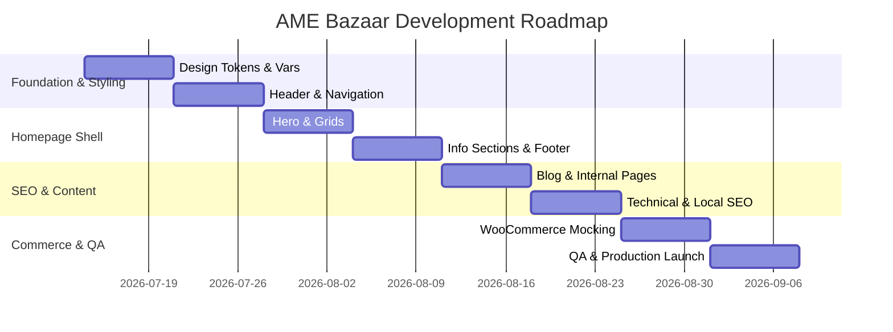

# ROADMAP.md - 2-Month Roadmap Details

- **Last Updated:** 2026-07-14
- **Version:** 1.0.0
- **Owner:** AME Bazaar AI OS Core
- **Purpose:** Highlights core developmental phases, timelines, and deliverables.
- **Dependencies:** docs/MASTER_PLAN.md
- **Status:** Active

---

## 1. Roadmap Overview

The primary objective for the next two months is to stand up the digital platform core, optimize it for local search visibility, and prepare the foundation for online sales.

## 2. Core Roadmap Milestones
- **Milestone 1: AI Operating System Core Repository Setup (Current)**
  - Establish docs, prompt rules, memory state files, and base directory structures.
- **Milestone 2: Responsive Base Theme & Navigation Shell**
  - Implement standard accessible header, mobile-responsive navigation drawer, and global variables.
- **Milestone 3: Homepage Component Assembly**
  - Build interactive category grids, customer testimonial sliders, store map integration, and FAQ accordions.
- **Milestone 4: SEO, Schema, and Launch**
  - Setup structured schema JSON-LD, optimize core web vitals (WebP images, minified resources), and release the initial version.
